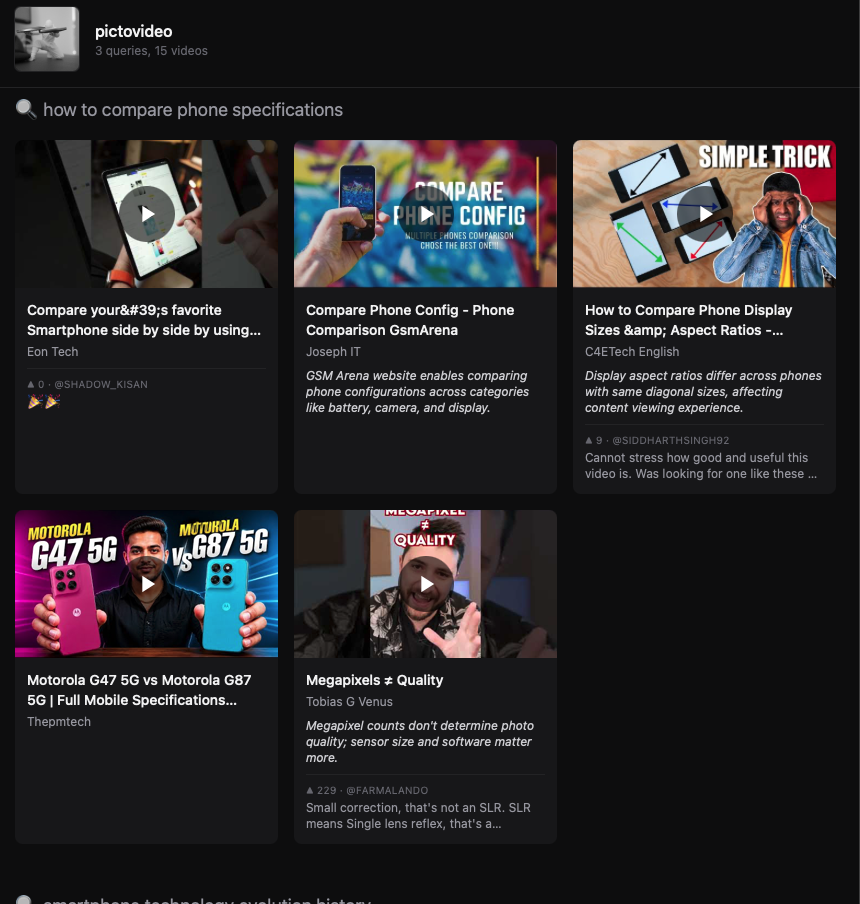

# pictovideo

Drop in a photo. Get back a dark-themed HTML page of YouTube videos that match it from three angles — literal, instructional, and broader-topical — with a one-sentence transcript summary and the top comment under every card.



```
photo.jpg
  -> Claude Haiku 4.5 (vision)          -> 3 diverse search queries
  -> youtube-pp-cli search-bulk         -> 15 top YouTube picks (5 per query)
  -> videos-transcript + videos-comments (parallel, per pick)
  -> Claude Haiku 4.5 (batched)         -> one-sentence summary per video
  -> Tailwind dark page                 -> opened in your browser
```

## Prereqs

- Node 22.6+ (uses native `--experimental-strip-types` for TS)
- An Anthropic API key
- `youtube-pp-cli` on your `$PATH`, authed with a YouTube Data API v3 key
  - https://github.com/justinwfu/youtube-pp-cli
  - One-time setup: `youtube-pp-cli auth set-token <YOUR_YT_KEY>`

## Setup

```bash
npm install
cp .env.example .env
# fill in ANTHROPIC_API_KEY in .env
```

## Usage

```bash
npm run find-vids -- ./path/to/photo.jpg
```

Outputs `out/<timestamp>-pictovideo.html` and opens `out/latest.html` (symlink) in your browser.

Supported formats: JPEG, PNG, WEBP, GIF. HEIC is rejected (iPhone users: re-export as JPEG).

Photos larger than Anthropic's 5 MB image limit are auto-downscaled with `sharp` before being sent to Claude (tries widths 2048 → 1536 → 1024 → 768 and keeps the first that fits). EXIF orientation is baked into the pixels so portrait iPhone shots arrive upright. GIFs pass through untouched.

## Flags

- `--no-cache` — bypass the local vision-response and per-video enrichment caches (useful when tweaking prompts)
- `--show-queries` — print the 3 generated queries to stderr before fetching videos
- `--no-enrich` — skip the transcript-summary + top-comment enrichment pass (faster, fewer API calls)

## Tests

```bash
npm test                  # 21 node:test cases, ~1s
UPDATE_GOLDENS=1 npm test # regenerate tests/fixtures/*.html after intentional render changes
```

Per-feature acceptance criteria (automated + manual) live in `tests/acceptance.md`.

## How caching works

- Claude vision responses are cached at `.cache/vision/<sha1-of-image>.json` (24h TTL).
- Per-video enrichments (transcript snippet, top comment, Claude-summarized one-liner) are cached at `.cache/enrich/<videoId>.json` (7d TTL).
- YouTube responses are cached by `youtube-pp-cli` itself in its own SQLite store (6h TTL). No second cache layer here.

## Enrichment (default)

By default every page run also pulls a transcript and the top comment for each of the 15 picks, and asks Claude for a one-sentence "what this video actually delivers" line per video. This turns the page from "here are titles" into "here's what each video delivers + the one comment that mattered." Cost: ~30 extra cheap CLI calls + 1 Claude call per run, all cached aggressively. Pass `--no-enrich` to skip if you want the bare grid.
